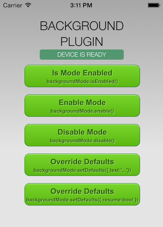
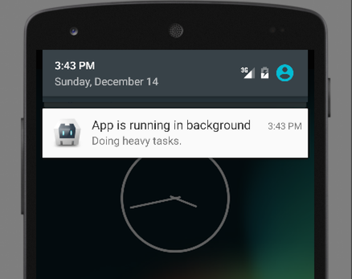

Cordova Background Plugin - Sample App
======================================



[Cordova][cordova] plugin to prevent the app from going to sleep while in background, device get locked or screen goes off.

## Instructions
Clone the _example_ branch:

    git clone -b example https://github.com/katzer/cordova-plugin-background-mode.git

And then execute:

    cordova run [android|browser|ios|windows]

These will launch the simulator or any plugged in device and start the example application as seen below in the screenshots. It is also possible to open the project with [Android Studio][studio] or [Xcode][xcode].

A click on the _Background_ enables the mode and starts them once the app is going into the background. 

```javascript
// 1) Request background execution
cordova.plugins.backgroundMode.enable();

// 2) Now the app runs ins background but stays awake
cordova.plugins.backgroundMode.on('activate', function () {
    setInterval(function () {
        cordova.plugins.notification.badge.increase();
    }, 1000);
});

// 3) App is back to foreground
cordova.plugins.backgroundMode.on('deactivate', function () {
    cordova.plugins.notification.badge.clear();
});
```

</img>

On __Android__ a customizable notification will appear to inform the user that the app is performing a task in the background. It's possible to prevent any system notification by using the __silent mode__.

Customizable attributes are the title, text, ticker, icon and color:

```javascript
cordova.plugins.backgroundMode.setDefaults({ color: 'FF0000' });
```

To use the silent mode:

```javascript
cordova.plugins.backgroundMode.setDefaults({ silent: true });
```

Please read the plugin's [README][readme] for further requirements and informations.

## License

This software is released under the [Apache 2.0 License][apache2_license].

Made with :yum: from Leipzig

© 2017 [appPlant GmbH][appplant]


[cordova]: https://cordova.apache.org
[readme]: https://github.com/katzer/cordova-plugin-background-mode/blob/master/README.md
[studio]: https://developer.android.com/sdk/installing/studio.html
[xcode]: https://developer.apple.com/xcode/
[vs]: https://www.visualstudio.com
[apache2_license]: http://opensource.org/licenses/Apache-2.0
[appplant]: www.appplant.de
